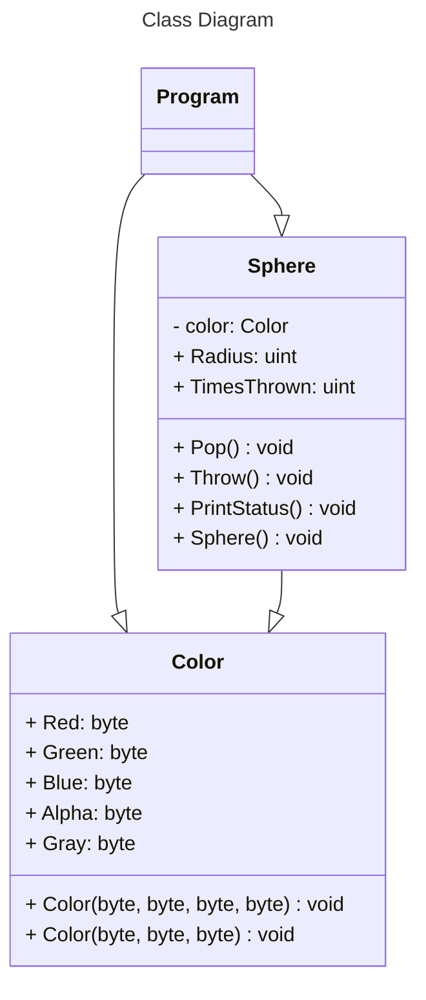

# Better Color Spheres

```mermaid
---
title: Class Diagram
---
classDiagram
    Program --|> Color
    Sphere --|> Color
    Program --|> Sphere
    class Program{
        
    }
    class Sphere{
        - color: Color
        + Radius: uint
        + TimesThrown: uint
        + Pop() void
        + Throw() void
        + PrintStatus() void
        + Sphere() void
    }
    class Color{
        + Red: byte
        + Green: byte
        + Blue: byte
        + Alpha: byte
        + Gray: byte
        + Color(byte, byte, byte, byte) void
        + Color(byte, byte, byte) void
    }
    
```
